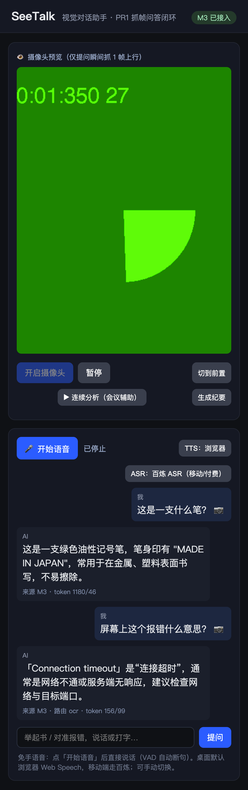
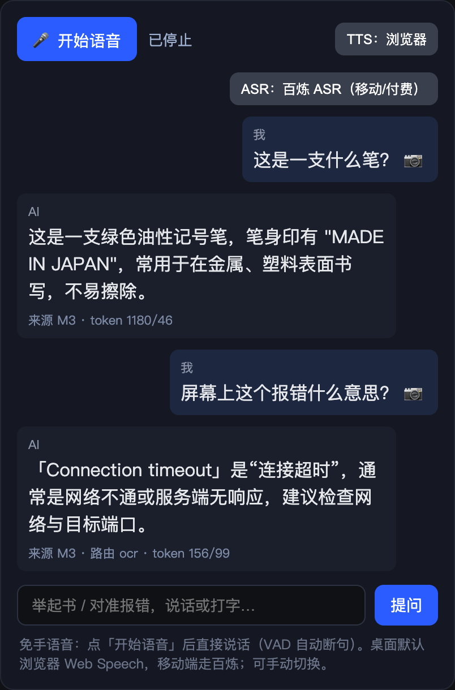
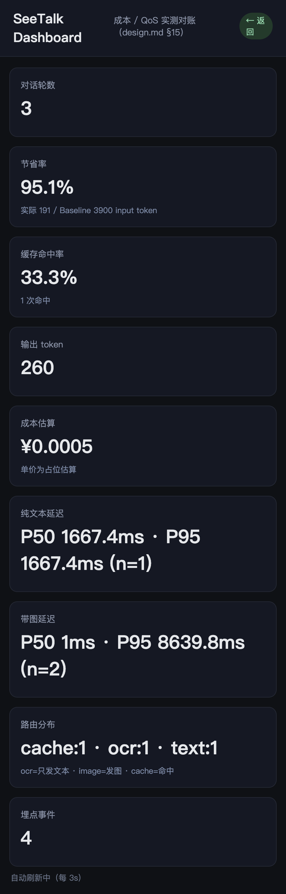

# SeeTalk · AI 视觉对话助手

实时多模态 AI 对话助手:打开摄像头与麦克风,让 AI 看见环境、听见用户、自然回应。

> 📋 **评审先看这里**:[`SUBMISSION.md`](./SUBMISSION.md) —— 提交说明/评审导览,含题目要求的两份交付物(用户故事 计划 vs 实现、成本控制 想到 vs 采用)。
> 完整设计见 [`design.md`](./design.md)。

## 界面

<p>
  
  
  
</p>

左:竖屏主界面(摄像头预览 + 语音/连续分析控件;图为无头测试用摄像头画面)。
中:多模态问答(实时显示来源/路由/token)。
右:`/dashboard` 成本与 QoS **实测对账**(节省率、缓存命中、路由分布、延迟分桶)。

## 架构一句话

浏览器(粗闸门:限帧 / VAD / 抓帧)→ Flask(细闸门:OCR 路由 / 变化检测 / 缓存 / 上下文)
→ **MiniMax-M3 多模态**(Anthropic 兼容直连,真看像素)。ASR 桌面用浏览器 Web Speech、
移动用百炼;TTS 浏览器免费 / 百炼高音质。唯一主要付费项是 M3 图片 token,所有省钱手段都削它。

## 当前进度

### PR1 · 抓帧问答闭环
- ✅ Flask 骨架 + `AIService`(M3 直连多模态 + Mock 降级层)
- ✅ 前端开摄像头、按需抓 1 帧(降分 512px)、文字提问、显示回答与 token
- ✅ 无 Key 时自动 Mock,项目照常可跑(产出明确标注"降级示例",不冒充)

### PR2 · 语音交互闭环
- ✅ **免手 VAD**:浏览器端能量阈值断句(`static/voice.js`)
- ✅ **ASR 分层**:桌面浏览器 Web Speech(免费)/ 移动端百炼 Paraformer(`/api/asr` 代理,Key 仅在服务端)
- ✅ **流式回答 + 首句优先 TTS**:`/api/ask_stream`(SSE)边收边播(`static/tts.js`)
- ✅ 真机验证:M3 流式 SSE 实时输出;百炼 ASR 语音往返(合成「你好,这是语音识别测试」→ 准确转写)

### PR3 · 成本控制 + Dashboard
- ✅ **视觉缓存 + 变化检测**:感知哈希(average hash),同画面同问命中缓存、零云调用(`vision_cache.py`)
- ✅ **token 实测对账**:每轮记 实际 token vs Baseline(朴素每轮整图),算节省率(`metrics.py`,SQLite)
- ✅ **延迟分桶**(纯文本 / 带图 P50/P95)+ **埋点 EventLog**
- ✅ **Dashboard**:`/dashboard` 实时展示轮数 / 节省率 / 命中率 / 成本估算 / 延迟
- ✅ 真机验证:同图同问第二次命中缓存(token 0)、实测节省率 95.4%

### PR4 · OCR 优先路由
- ✅ **本地 Tesseract OCR**:纯文本场景(报错/英文/代码)先本地 OCR → 只发文本给 M3,省掉整图 token(`ocr_service.py`)
- ✅ 路由判定:字符数 + 置信度阈值;非文本场景仍发降分图;无 tesseract 自动退化为发图
- ✅ Dashboard 新增**路由分布**(ocr/image/cache)
- ✅ 真机验证:英文报错图 → `route=ocr`,input token 72(发图需数百),M3 正确解释 TypeError
- ✅ **中文 OCR**:`chi_sim+eng`,中文文本场景也走 OCR 路由(真机:「系统错误:文件未找到」识别置信度 96%)
### PR6 · 百炼高音质 TTS(CosyVoice)
- ✅ **CosyVoice 实时合成**(`ai/bailian_tts.py`,DashScope WS,复用 ASR 同一把 Key)
- ✅ `/api/tts`(text → mp3);前端 TTS 双模式可切:浏览器(免费默认)/ 百炼高音质(付费档)
- ✅ 首句优先沿用:逐句合成播放;百炼不可用自动回退浏览器
- ✅ 真机验证:`cosyvoice-v2 + longxiaochun_v2` 合成 22050Hz 合法 MP3
### PR7 · A/B 实验框架(§18)
- ✅ **确定性分桶**:按 session_id 哈希分配变体(同用户恒定),`experiments.py`
- ✅ 首个实验 `ocr_first`(on/off):量化"OCR 只发文本省 token vs 误判风险"
- ✅ metrics 记录变体 + 按变体对比节省率/延迟;`/api/experiments` 看分配与对比
- ✅ 前端 localStorage 稳定 session_id;真机验证 on/off 分桶 + 对比落库
### PR8 · 评估框架(§17)
- ✅ **可复现样例集**实测能力,避免伪指标:OCR 字符准确率 + 对话关键词命中率
- ✅ 打分确定性(`difflib` 相似度 / 关键词命中),render/svc/ocr 可注入便于单测
- ✅ `python3.11 evaluation.py` 跑真实服务出报告;真机:OCR 1.0、QA 1.0
### PR9 · 连续分析模式(会议辅助,Story 5)
- ✅ `/api/observe` 每帧客观描述并累积;**变化检测**画面没变即跳过(省钱)
- ✅ `/api/summary` 把连续观察交给 M3 汇总成会议/场景纪要(纯文本汇总省 token)
- ✅ 前端「连续分析」开关每 4s 抓帧 + 「生成纪要」按钮
- ✅ 真机验证:幻灯片切换逐帧描述、重复帧跳过、纪要正确追踪变化
- 🎉 design.md MVP + 全部 §14 省钱杠杆 + §17/§18 框架 + 会议辅助 全部落地

## 运行

```bash
pip install -r requirements.txt
cp .env.example .env          # 可选:填入 MINIMAX_API_KEY;不填则 Mock 模式
python3.11 app.py             # http://localhost:8000
```

浏览器打开后:点「开启摄像头」→ 举起物体 → 输入问题 → 提问。
顶部徽标显示当前是「M3 已接入」还是「Mock 模式」。

> 注:摄像头/麦克风需**安全上下文**才能开启(浏览器限制)。
> - 本机:用 `http://localhost:8000`(localhost 视为安全)即可,**无需 HTTPS**。
> - 手机/局域网:必须 HTTPS。启动时设 `SEETALK_HTTPS=1 python3.11 app.py`,会用 openssl 自动生成自签证书并以 `https://` 提供(自签证书浏览器会提示风险,点继续即可)。
>
> OCR 优先路由需本地 tesseract;中文场景需 `chi_sim` 语言包(放入 tessdata 目录)。
> 缺包时自动退化为发图,功能不受影响。可用 `OCR_LANG` 覆盖语言(默认自动 `chi_sim+eng`)。

## 手机 App(Android)

`android/` 是一个 WebView 套壳工程,把响应式 Web 装进原生壳在手机上验证。
关键是补齐了普通套壳缺的**摄像头/麦克风权限**与**自签 HTTPS**(getUserMedia 需安全上下文)。
用法:电脑 `SEETALK_HTTPS=1 python3.11 app.py` 启动 → Android Studio 打开 `android/` 一键 Run 到手机 → 填电脑的 `https://<IP>:8000`。详见 [`android/README.md`](./android/README.md)。
> WebView 无浏览器语音,故语音走百炼 ASR(需配 `BAILIAN_API_KEY`);默认后置摄像头,适合"看世界"。

## 测试

```bash
python3.11 -m pytest -q --cov=. --cov-report=term-missing
```

**实测(本机 Python 3.11):103 passed,覆盖率 96%。**
策略遵循 design.md §22:Mock 云(MiniMax/百炼),只测确定性逻辑(载荷构造、响应解析、
降级、入参校验、图片解析),不测非确定性的 AI 答案本身。未覆盖部分为 gevent 启动入口
与需真实 Key 的初始化分支。

## 目录

```
see_talk/
  app.py            Flask 入口:/api/ask · /api/ask_stream · /api/asr · /api/tts · /dashboard
  config.py         env/.env 配置 + PlanConfig 档位
  vision_cache.py   感知哈希:视觉缓存 + 变化检测(省钱核心)
  metrics.py        SQLite:token 对账 / 节省率 / 延迟分桶 / 埋点
  ocr_service.py    本地 Tesseract OCR(OCR 优先路由)
  experiments.py    A/B 实验:确定性分桶 + 变体对比
  evaluation.py     评估框架:OCR 准确率 + 对话成功率
  observations.py   连续分析:观察累积 + 变化检测 + 纪要汇总
  ai/
    service.py      AIService 统一入口(降级编排)
    minimax.py      MiniMax-M3 多模态客户端(非流式 + 流式)
    bailian.py      百炼 Paraformer 实时 ASR(DashScope WS)
    bailian_tts.py  百炼 CosyVoice 实时 TTS(DashScope WS)
    mock.py         无 Key 降级层
    types.py        ChatMessage / VisionReply
  templates/        index.html · dashboard.html
  static/           app.js · voice.js(VAD+ASR)· tts.js(首句优先)· style.css
  tests/            pytest(Mock 云,确定性)
```

## 安全

密钥只存服务端(`.env`,已 gitignore),前端不可见;百炼 wss 由 Flask 代理。
隐私:按需抓帧 + 默认不落盘原始媒体,UI 常驻「正在看」指示(design.md §25)。

## AI 协作说明(design.md §27)

本项目在 AI 辅助下开发,如实声明如下。

### 使用的 AI 工具
- **Claude Code**(主力):需求澄清(grill-me 逐项压测设计)、编码、单测、调试、Git/PR 流程。
- 允许的协作工具同 design.md §27:Hermes / Claude Code / Codex / Cursor Agent / OpenHands。

### AI 承担了什么
- 与作者对话打磨 `design.md`(端云分工、成本模型、QoS、隐私等逐条达成共识)。
- 按 design.md §26 的 PR 顺序实现各模块,并配套 Mock 云的确定性单测。
- 接入真实云能力时逐个**真机验证**(M3 多模态/流式、百炼 ASR 语音往返、CosyVoice TTS、缓存命中、OCR 路由、A/B、评估、会议纪要)。

### 人类作者承担了什么
- 提供技术栈约束与真实 API Key;关键产品取舍(平台 / 语音模态 / 付费分层等)由作者拍板。
- 审阅 PR 与合并、把控方向。

### 底线
- **实现与文档一致**:design.md 描述的能力均有对应实现与测试;未实现项在 §5/§6 如实标注。
- **不冒充**:无 Key 时降级产出明确标注「示例 / 降级」;指标以实测为准(Dashboard / 评估框架),不写死伪指标。
- **密钥安全**:AI 全程不将任何 Key 写入仓库,提交前自动扫描兜底。
